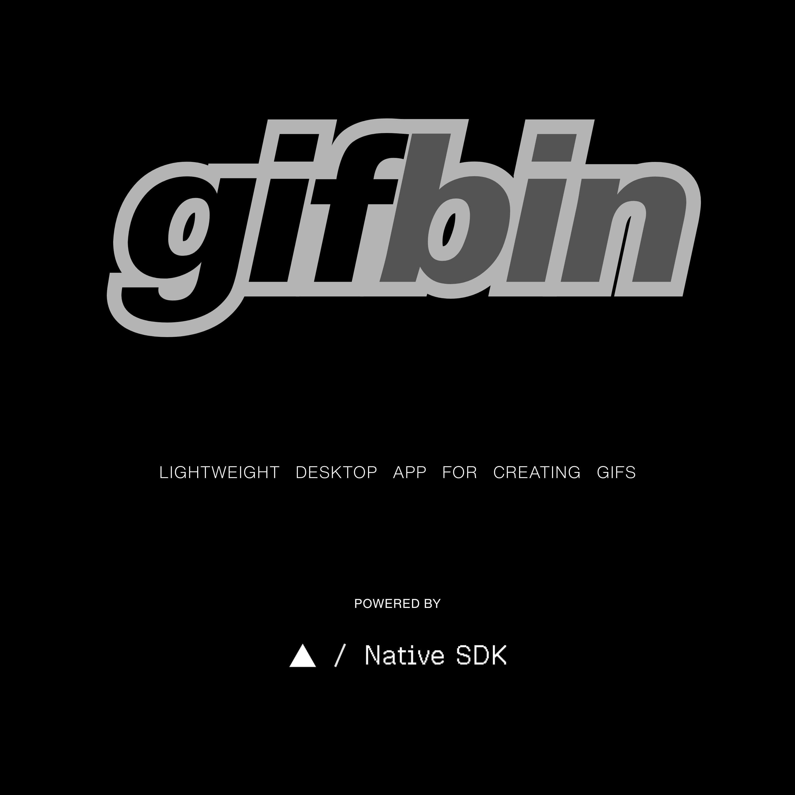
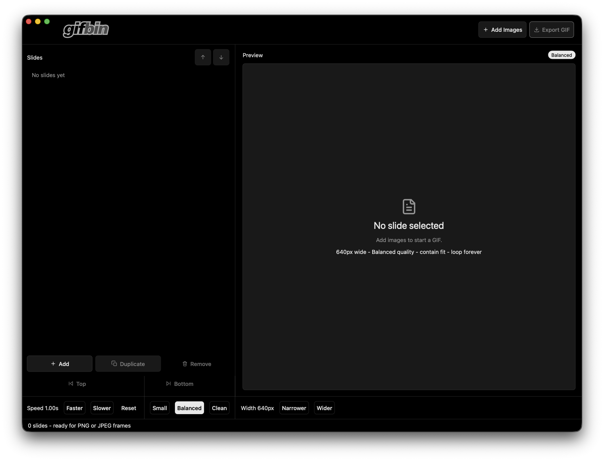

# gifbin

<p align="center">
  
</p>

<p align="center">
  <a href="https://github.com/vercel-labs/native"></a>
  <a href="https://ziglang.org/"></a>
  <a href="app.zon"></a>
  <a href="src/main.zig"></a>
</p>

gifbin is a small native desktop app for turning PNG/JPEG image frames into an
animated GIF. It uses a Native SDK GPU canvas surface and Zig for the app model,
dialogs, drag/drop, preview registration, and GIF export.

<p align="center">
  
</p>

## Native SDK

The important architectural choice in this repo is Vercel Labs Native SDK
0.5.1. Native SDK gives the app a real desktop window, native lifecycle/runtime
services, GPU-rendered surfaces, canvas UI widgets, automation hooks, dialogs,
and packaging/build tooling while keeping application behavior in Zig.

In this app:

- `app.zon` is the product manifest: app id, display name, icon, macOS platform,
  permissions, GPU surface window, and security policy.
- `src/main.zig` wires the Native SDK `UiApp`, declares the canvas view, handles
  drag/drop and dialogs, registers preview images, and runs the app.
- `src/model.zig` is the app state machine: slides, selection, ordering, speed,
  quality, output width, status text, and pending native actions.
- `build.zig` owns the Native SDK build graph for this expanded app and links
  the platform image bridge plus GIF encoder.
- `dev.zig` and `scripts/dev` are the repo-local developer runner so the app can
  be launched from the terminal with useful errors and quiet default logs.
- `docs/native-sdk-source/` is a small local snapshot of the Native SDK docs
  from `vercel-labs/native`, kept so the implementation choices are easy to
  audit without hunting through external docs.

The manifest explicitly uses a GPU surface:

```zig
.capabilities = .{ "native_views", "gpu_surfaces" },
```

and the runtime path disables the JavaScript window API:

```zig
.js_window_api = false,
```

The manifest also explicitly excludes the WebView layer:

```zig
.webview_layer = "exclude",
```

That is the core point of the project: a native-rendered GIF tool, written in
Zig, using Native SDK as the desktop runtime.

## Libraries

- **Vercel Labs Native SDK**: desktop runtime, app manifest, GPU surface,
  Native SDK canvas UI, dialogs, drag/drop events, automation, and packaging
  hooks.
- **Zig 0.16**: app state, update loop, Native SDK wiring, dev CLI, build
  graph, tests, and GIF export pipeline.
- **Apple CoreFoundation/CoreGraphics/ImageIO**: macOS PNG/JPEG metadata and
  decode path in `src/platform_image_macos.m`.
- **msf_gif 2.4**: tiny C GIF encoder vendored in `third_party/msf_gif/`, used
  through `src/gif_writer.zig`.
- **Native SDK automation**: smoke checks for rendered GPU canvas output through
  `native automate`.
- **Bash + Zig runner**: `scripts/dev` and `dev.zig` provide the project CLI
  instead of relying on Finder double-click behavior.

## Features

- Import PNG/JPEG frames through native open dialogs.
- Drag and drop image files into the Native SDK window.
- Reorder, duplicate, remove, and select frames.
- Preview the selected image using Native SDK canvas image registration.
- Tune frame speed, output width, and encoder quality.
- Preserve frame aspect ratio with contain-fit output, avoiding unnecessary
  crop when source images differ in shape.
- Export an actual animated GIF with `msf_gif`.
- Run quiet terminal-first dev builds that show real errors without dumping
  every input event.

## Commands

```sh
zig run dev.zig                        # tiny interactive project CLI
zig run dev.zig -- help                # CLI commands and options
zig run dev.zig -- run                 # fast dev run: Debug build, quiet logs
zig run dev.zig -- native              # official Native SDK CLI path: native dev .
zig run dev.zig -- smoke               # launch, assert the canvas renders, stop
zig run dev.zig -- check               # run Native SDK checks and app Zig tests

zig build dev                          # short alias for the dev run
zig build dev-smoke                    # short alias for smoke verification
zig build dev-check                    # short alias for preflight checks
zig build test                         # run app tests
zig build                              # build the app binary
```

`zig run dev.zig -- run` is the recommended development path for this repo. It
builds the app in Debug mode without rerunning the full test suite and keeps
automation and event tracing off by default. Build errors, panics, and app
stderr still print in the terminal. Use `zig run dev.zig -- check` for the full
preflight and `zig run dev.zig -- smoke` for an automation-enabled launch.

Use verbose tracing only when debugging low-level Native SDK runtime/input
events:

```sh
zig run dev.zig -- run --verbose
TRACE=events zig build dev
```

Zig source changes need a restart of the dev runner.

## Releases

GitHub releases are automated from SemVer tags:

```sh
version=0.0.3
git tag "v${version}"
git push origin "v${version}"
```

Pushing a `vX.Y.Z` tag runs `.github/workflows/release.yml`, stamps that version
into the Native SDK manifests for the release build, validates the app, builds a
ReleaseSafe macOS binary, packages `zig-out/package/gifbin.app`, zips it, and
publishes the zip plus a SHA-256 checksum to the GitHub release.

For local packaging, use the direct Native SDK CLI path:

```sh
zig build -Doptimize=ReleaseSafe
native package --target macos --manifest app.zon --binary zig-out/bin/gifbin
```

## Native SDK CLI

The repo also keeps the official Native SDK CLI path available:

```sh
zig run dev.zig -- native
```

That delegates to:

```sh
native dev .
```

For this app, `zig run dev.zig -- run` is usually cleaner because the repo owns
`build.zig` and has project-specific ImageIO, CoreGraphics, and `msf_gif` wiring.

## Development Notes

Do not double-click `zig-out/bin/gifbin` in Finder during development. macOS
treats it as a Unix executable and may open it in a separate Terminal app. Use
the project runner instead:

```sh
./scripts/dev
```

The Native SDK dependency is a local path in `build.zig.zon`. Reconfigure it
after installing or moving the SDK:

```sh
bun add -g @native-sdk/cli@0.5.1
./scripts/configure-native-sdk-path
```

Pass an explicit SDK checkout path to that script when it is not installed
through Bun. Use `./scripts/native-skills` for the matching SDK guidance.
